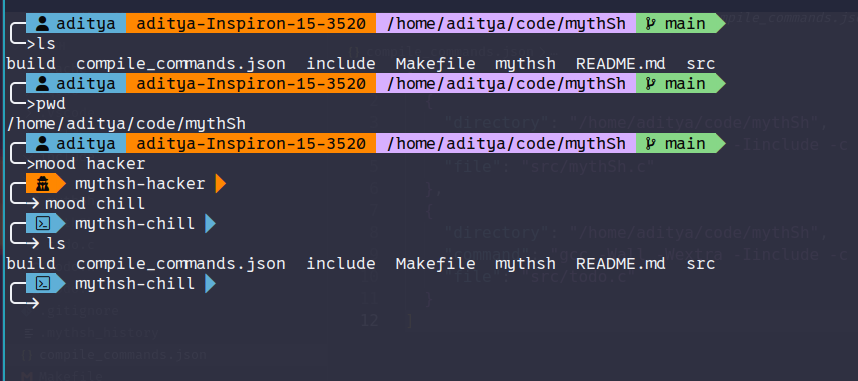

# MythSh — A Minimal Yet Powerful Custom Shell

MythSh (*Mythical Shell*) is a lightweight, customizable shell written in C — built to be **fast**, **beautiful**, and **hackable**.
It brings a modern Powerlevel10k-inspired aesthetic, with colorful prompt segments, Nerd Font icons, and a modular configuration system.

---

## 📸 Screenshots

### MythSh Default Theme

---

## ✨ Features

* 🧠 **Command Execution** — Run system commands seamlessly
* 🕘 **Command History** — Navigate previous commands using ↑ / ↓
* 💾 **Persistent History File** — Commands are saved between sessions
* 🎨 **Powerlevel10k-Style Prompt** — Colored segments & icons
* 🔍 **Git Integration** — Shows current branch in prompt
* ⚙️ **Configurable via `.mythrc`** — Customize colors, symbols, and username display
* 🧩 **Nerd Font Icons** — Folder, git branch, clock, etc.
* 🚀 **Lightweight & Fast** — Pure C, zero external dependencies

---

## 🛠️ Installation

### 1️⃣ Clone the Repository

```bash
git clone https://github.com/adityapaul26/mythSh.git
cd mythsh
```

### 2️⃣ Build MythSh

```bash
make
```

> Or manually compile:
>
> ```bash
> gcc mythsh.c -o mythsh
> ```

### 3️⃣ Run MythSh

```bash
./mythsh
```

---

## 🧰 Optional — Add to Your System Path

If you want to use MythSh globally:

```bash
sudo cp mythsh /usr/local/bin/mythsh
```

Then launch it anytime:

```bash
mythsh
```

---

## 🖋️ Configuration

You can edit the `.mythrc` file to personalize your shell prompt.

Example:

```bash
# .mythrc
setprompt ╭─%u%h%d%g\n╰─>
```

Reload MythSh to apply changes:

```bash
source ~/.mythrc
```

---

## 🎨 Install a Nerd Font (for icons)

To get those **beautiful icons and separators** — you need a Nerd Font installed and enabled in your terminal.

### 🧩 Step-by-step:

1. Go to: [https://www.nerdfonts.com/font-downloads](https://www.nerdfonts.com/font-downloads)
2. Download any patched font. Recommended:

   * **FiraCode Nerd Font**
   * **JetBrainsMono Nerd Font**
   * **Hack Nerd Font**
3. Install the font on your system:

   * **Linux:** extract and move to `~/.local/share/fonts`, then run `fc-cache -fv`
   * **Windows:** right-click → *Install for all users*
   * **macOS:** double-click → *Install Font*
4. In your terminal emulator (GNOME Terminal, Kitty, Alacritty, etc.):

   * Open **Preferences → Profile → Font**
   * Select your installed **Nerd Font**
5. Restart your terminal and run:

   ```bash
   ./mythsh
   ```

---

## 💡 Usage Tips

| Key      | Action                   |
| -------- | ------------------------ |
| ↑ / ↓    | Navigate command history |
| Ctrl + L | Clear screen             |
| Ctrl + D | Exit MythSh              |
| `help`   | List built-in commands   |
| `config` | Reload configuration     |

---

## 🧱 Folder Structure

```
mythsh/
├── .cache
    └── clangd
    │   └── index
    │       ├── mythSh.c.8D4BCDB00853A1C0.idx
    │       ├── todo.c.9B6FE5940C9F1FA6.idx
    │       └── todo.h.2036C4F9694109AD.idx
├── .gitignore
├── .mythsh_history
├── Makefile
├── README.md
├── compile_commands.json
├── mythsh
└── src
    ├── mythSh.c
    ├── todo.c
    └── todo.h
```

---

## 🧑‍💻 Contributing

Pull requests are welcome!
If you’d like to add new prompt themes, icons, or internal commands:

1. Fork the repo
2. Create your branch (`git checkout -b feature-amazing`)
3. Commit changes (`git commit -m "Add cool prompt feature"`)
4. Push to branch (`git push origin feature-amazing`)
5. Open a PR 🚀


---

## ⚖️ License

MIT License © 2025 adityapaul26

Feel free to use, modify, and share — with attribution.
